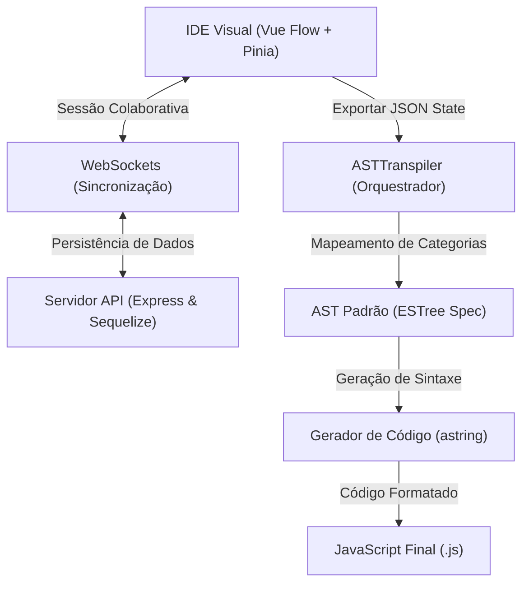

<p align="center">
  
</p>

<p align="center">
  <strong>IDE e Compilador de Programação Visual para Web</strong>
</p>

<p align="center">
  
  
  
</p>

---

### O que é o Creatio?

O **Creatio** é uma plataforma e IDE de programação visual de propósito geral que permite criar, depurar e transpilar algoritmos e estruturas lógicas complexas de forma interativa. Em vez de escrever linhas de texto tradicionais, os desenvolvedores conectam blocos lógicos visualmente para modelar o fluxo e os dados, que são então compilados em tempo real para código JavaScript legível e utilizável.

---

### Como funciona a Arquitetura?

O projeto está estruturado como um monorepo que une uma interface rica, um backend colaborativo e um transpilador AST dedicado.



1. **Interface do Desenvolvedor (Frontend)**: Construído com Vue 3, Vuetify e Vue Flow, o espaço de trabalho manipula nós reativos de lógica, variáveis e funções, mantendo um estado JSON estruturado na memória local.
2. **Sincronização Colaborativa (Backend)**: Sessões ativas são sincronizadas em tempo real via WebSockets. O servidor Express gerencia sessões, autenticação de usuários e persistência dos metadados dos projetos no MySQL/MariaDB.
3. **Compilador AST (Package Compartilhado)**: O código JSON do editor visual é consumido pela biblioteca `@projeto/compiler`. O `ASTTranspiler` gerencia a árvore sintática dividida em escopos, delegando a transpilação aos submódulos `VariablesTranspiler`, `FunctionsTranspiler` e `LogicsTranspiler`, gerando por fim o código JavaScript via `astring`.

---

### Estrutura do Monorepo

```text
├── apps/
│   ├── api/            # API REST e Servidor WebSocket (Express + Sequelize)
│   └── web/            # Aplicação Frontend (Vue 3 + Vuetify + Vue Flow)
├── packages/
│   ├── compiler/       # Transpilador de nós visuais para código JavaScript (ESTree AST)
│   └── types/          # Definições de tipos TypeScript compartilhados entre API e Web
```

---

### Recursos Principais

* **Editor de Lógica Visual**: Uma tela dinâmica e de alta performance para criação e conexão de blocos lógicos.
* **Compilador Integrado**: Tradução automática e transparente de fluxogramas lógicos para a especificação abstrata de árvore de sintaxe (ESTree).
* **Trabalho Colaborativo**: Suporte nativo para múltiplos editores síncronos sobre o mesmo script por meio de WebSockets.
* **Estrutura Modular**: Lógica do transpilador estritamente organizada por escopo de variáveis, definições de funções e laços/condicionais sequenciais.

---

### Tecnologias Utilizadas

#### Frontend
* **Vue.js 3** — Framework principal reativo para web
* **Vuetify** — Biblioteca de componentes visuais baseada em Material Design
* **Vue Flow** — Motor de renderização e interação com grafos/nós
* **Pinia** — Gerenciador de estado global

#### Backend & Services
* **Node.js & Express** — Servidor web e roteamento de APIs
* **Sequelize** — ORM para integração e consultas no banco de dados
* **WebSockets** — Comunicação duplex em tempo real para sincronização colaborativa

#### Ferramentas & Compilação
* **Astring** — Gerador de código JavaScript a partir de especificações ESTree AST
* **Biome** — Linter e formatador de código estrito e ultrarrápido
* **pnpm** — Gerenciador de pacotes e workspaces do monorepo

---

### Como Executar o Projeto

Garante que você tenha o Node.js v22+ e o pnpm instalados em sua máquina.

```bash
# 1. Instalar as dependências do monorepo
pnpm install

# 2. Iniciar todos os projetos do workspace em modo de desenvolvimento (API, Web, etc.)
pnpm dev
```
